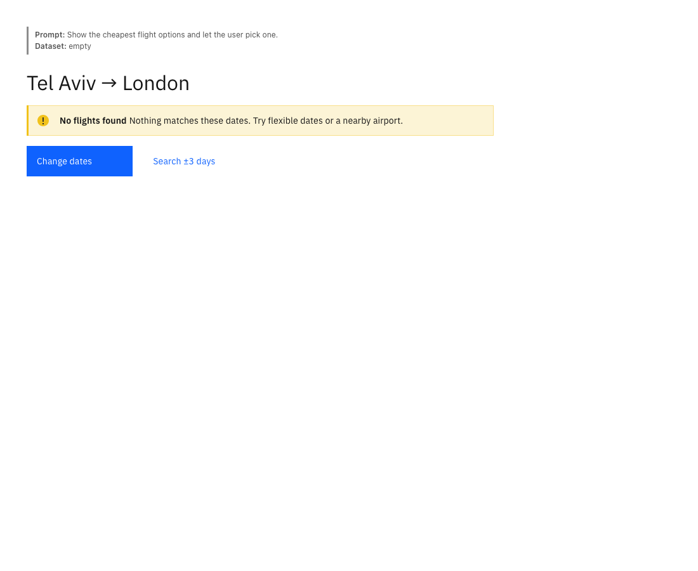
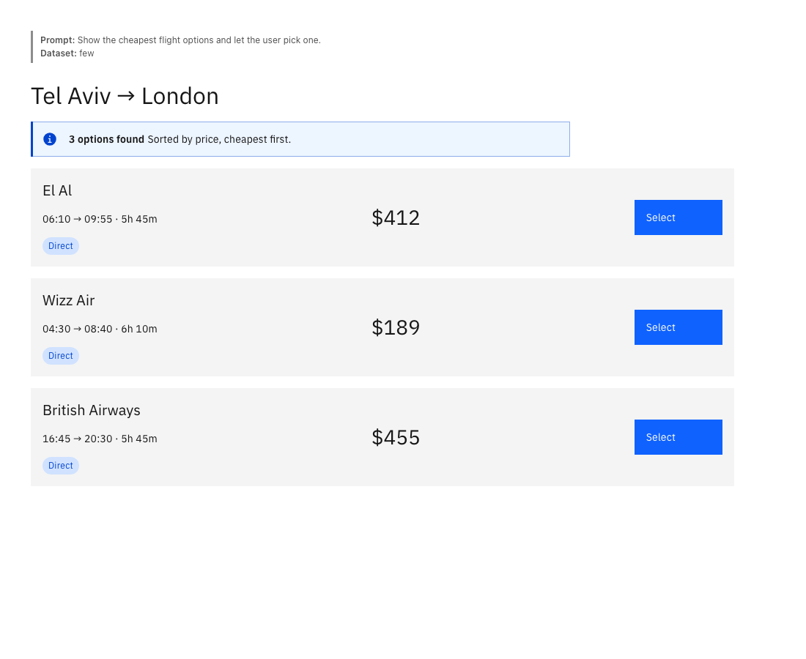
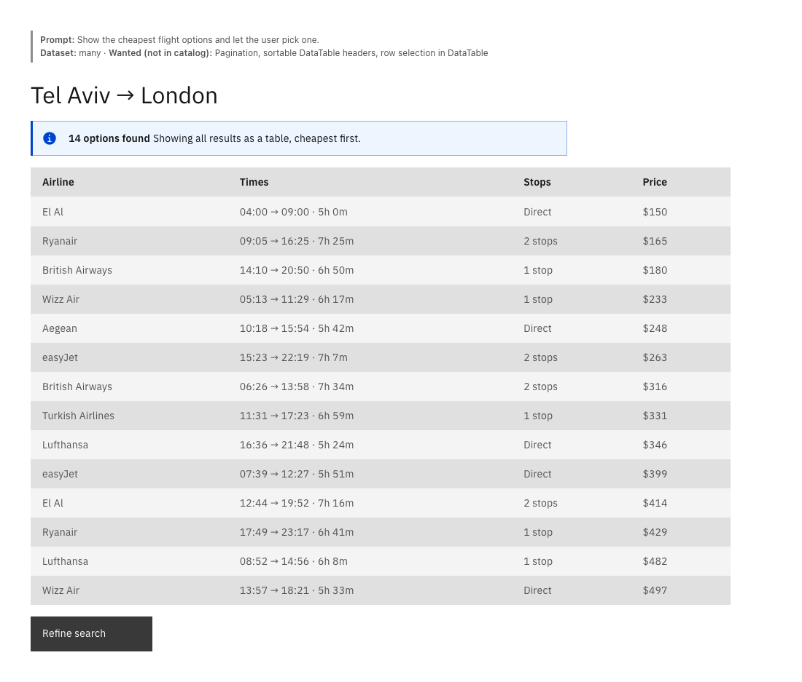
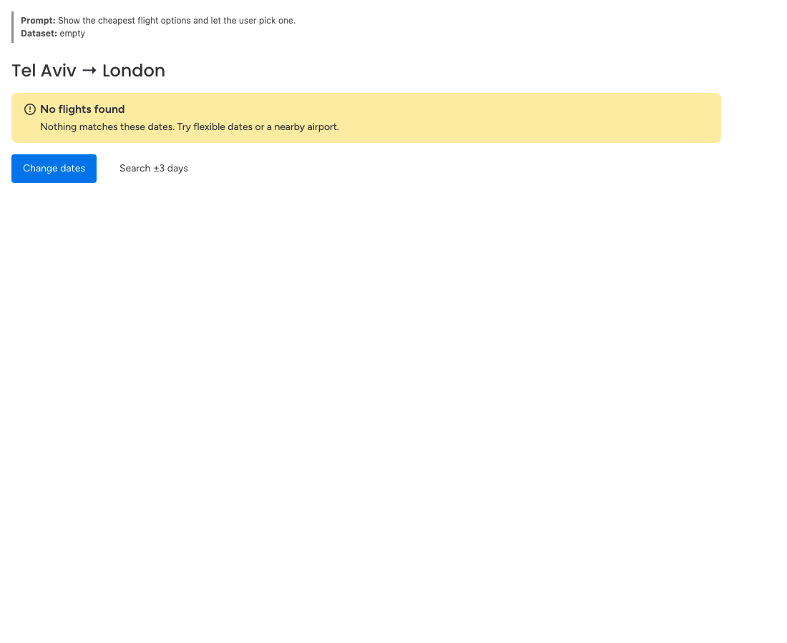
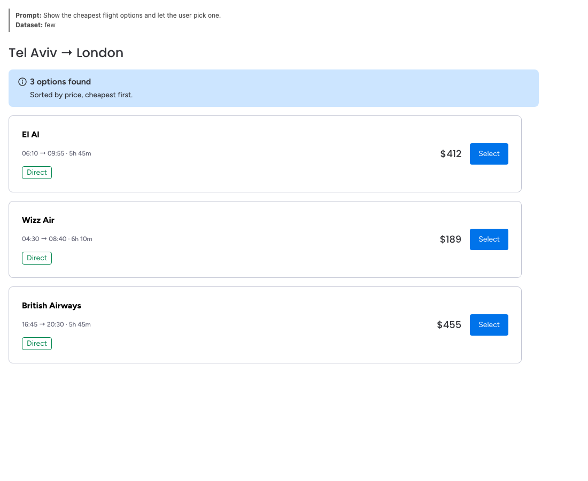
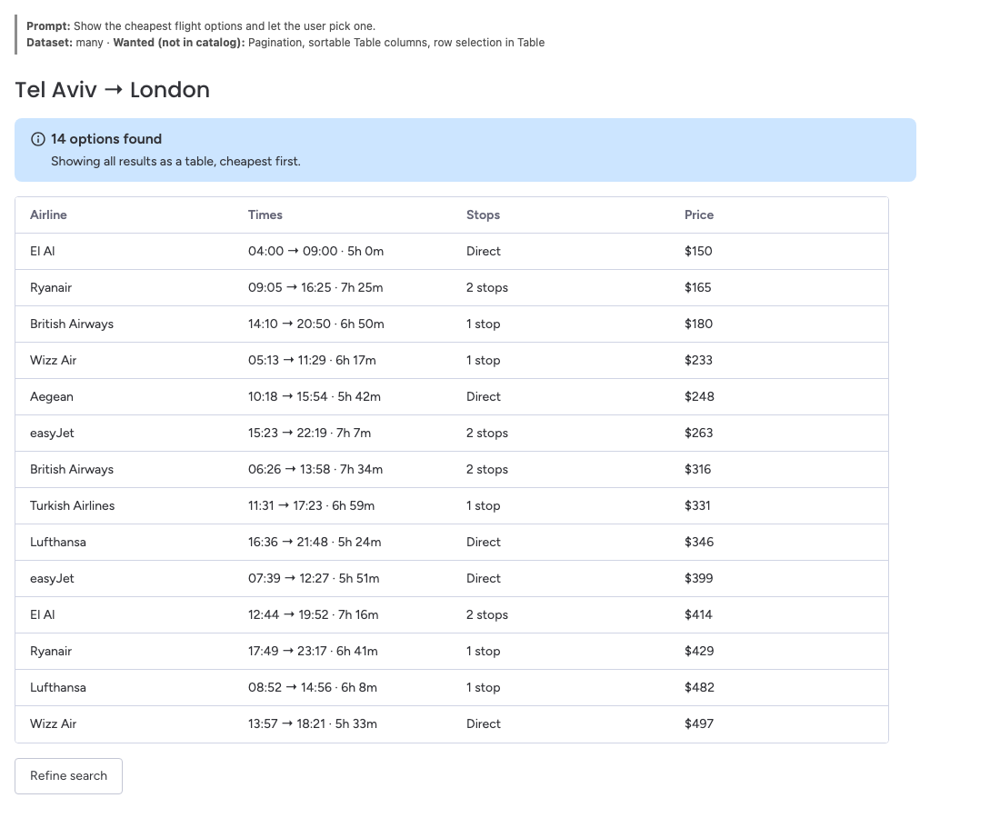

# storybook-a2ui

An agent skill that turns **Storybook into a playground for A2UI** (Google's Agent-to-UI protocol)
using **your own design-system components**.

Put data in, write a prompt, and see what UI an agent builds with your components, rendered as
real Storybook stories, one per dataset (empty / few / many…). Every run is validated against your
catalog and guardrails, and the report shows which components the agent used, misused, or wished it had.

Same prompt, same three datasets, two design systems. The agent chose an empty state, cards, and a table each time:

| | empty | few | many |
|---|---|---|---|
| **IBM Carbon** |  |  |  |
| **monday.com Vibe** |  |  |  |

## How it works

```
Storybook components ──► catalog.schema.ts (zod, A2UI names) + catalog.tsx (your components)
prompt + data/<scenario>/<dataset>.json ──► agent writes runs/<scenario>--<dataset>.json (A2UI v0.9)
                                          ──► a2ui.mjs check  (schema · refs · bindings · guardrails)
                                          ──► a2ui.mjs stories → A2UI.<Scenario>.stories.tsx
                                          ──► screenshot + REPORT.md (runs) + COVERAGE.md (your to-do list)
```

- Standard A2UI names (`Row`, `Column`, `Text`, `Card`, `Button`, `TextField`…) reuse the **official
  schemas** but render as your components, so any A2UI agent works unchanged.
- The agent running the skill (Claude Code, etc.) authors the A2UI, so no API key is needed.
- Renders through the official `@a2ui/react` v0.9 renderer.

## Install

```bash
git clone https://github.com/eransc/storybook-a2ui ~/Code/storybook-a2ui
ln -s ~/Code/storybook-a2ui/skill ~/.claude/skills/storybook-a2ui   # Claude Code
```

Then, in a repo with a React Storybook: _"use storybook-a2ui to show what an agent would build for
this flight data"_.

## Layout

```
skill/SKILL.md                 workflow the agent follows
skill/scripts/a2ui.mjs         describe | check | stories | coverage
skill/scripts/screenshot.mjs   render stories with the project's Playwright
skill/references/              A2UI authoring guide · catalog recipe · lessons checklist
skill/templates/               A2uiPlayground.tsx · guardrails.json
skill/examples/carbon/         reference catalog + runs + screenshots (IBM Carbon, CSS-grid layout)
skill/examples/vibe/           reference catalog + runs + screenshots (monday.com Vibe, flexbox)
```

## Status

v1 spike, React only, A2UI v0.9 (`@a2ui/react` 0.11). The renderer is written per design system
from the recipe (not auto-generated yet).

## Coverage report

`a2ui.mjs coverage` compares your **design system** (the Storybook index) with the **catalog** and the
agent's runs, and turns every gap into an action:

| Section | Tells you |
|---|---|
| Catalog → design system | which DS component backs each A2UI name; ⚠ entries built from tokens (not real DS components) |
| Not offered | DS components the agent never saw: **add** (agent asked for it) · excluded (with reason) · not reviewed |
| Wanted but missing | exists in DS → add it · capability gap in a catalog component · no component by that name (check synonyms) |
| Limitations | what A2UI can't express with this catalog (e.g. status → color) — manual work |

## Roadmap (v2 — "ship it", after someone asks)

- `a2ui` parameters in stories → `scaffold` command generates the catalog deterministically
- publish `catalog/<semver>.json` into `storybook-static` (catalogId carries the version); schema diff suggests the bump
- renderer exported from the DS npm package
- Storybook addon panel: catalog status (read-only) → Prompt / Data / Generate playground

## Distribution (planned)

Skills are shared as **GitHub repos**, not npm packages:

- `npx skills add eransc/storybook-a2ui` — the open skills CLI ([vercel-labs/skills](https://github.com/vercel-labs/skills)),
  installs into Claude Code, Cursor, Codex and others; GitHub is the registry.
- Claude Code plugin marketplace (`/plugin marketplace add eransc/storybook-a2ui`) — exact manifest layout to be confirmed
  against the Claude Code docs before publishing.
- Then list it in skill directories (skills.sh, awesome-claude-skills).

## License

MIT © Eran Schwartz
